# Práctica 1.1 Instalación de Postgresql versión 18 y Pgadmin en Windows

<br/><br/>

## Tiempo estimado
90 minutos

<br/><br/>

## Objetivos
Al completar este laboratorio, serás capaz de:
- Descargar e instalar **PostgreSQL 18** en sistema operativo Windows.
- Configurar el servicio de **PostgreSQL** con contraseña de superusuario.
- Instalar y configurar **PgAdmin 4** como herramienta de administración gráfica.
- Verificar la conexión exitosa entre **PgAdmin** y el servidor **PostgreSQL**.
- Familiarizarse con la interfaz de **PgAdmin** y sus componentes principales.

<br/><br/>

## Prerrequisitos
Conocimientos Requeridos:
- Conocimientos básicos de instalación de software en Windows.
- Comprensión básica de conceptos de red (puertos, localhost).
- Familiaridad con la navegación del sistema de archivos de Windows.

<br/><br/>

## Acceso Requerido
- Permisos de administrador en el computador Windows
- Conexión a internet activa (mínimo 10 Mbps)
- Usuario con capacidad de modificar servicios de Windows

<br/><br/>

## Entorno de Laboratorio

Requisitos de Hardware

| Componente         | Especificación                              |
|-------------------|----------------------------------------------|
| Procesador        | 64 bits (x86-64 o compatible)                |
| RAM               | Mínimo 4 GB (recomendado 8 GB)               |
| Espacio en Disco  | Mínimo 2 GB libres                           |
| Pantalla          | Resolución mínima 1280x720                   |
| Red               | Conexión a internet estable                  |


<br/><br/>

Requisitos de Software

| Software        | Versión                                   | Propósito                              |
|-----------------|-------------------------------------------|----------------------------------------|
| Windows         | 10 o 11 (64-bit)                          | Sistema operativo base                 |
| PostgreSQL      | 18.x                                      | Sistema gestor de base de datos        |
| PgAdmin         | 4.x (compatible con PostgreSQL 18)        | Interfaz gráfica de administración     |
| Navegador Web   | Chrome 90+, Firefox 88+, Edge 90+         | Para ejecutar PgAdmin 4                |


<br/><br/>

## Configuración Inicial

Antes de comenzar, verifica que tu sistema cumple con los requisitos:

- Verificar versión de Windows

    ```cmd
    systeminfo | findstr /B /C:"OS Name" /C:"OS Version"
    ```

- Verificar arquitectura del sistema (debe ser 64-bit)

    ```cmd
    wmic os get osarchitecture
    ```

- Verificar espacio disponible en disco C:

    ```cmd
    wmic logicaldisk get size,freespace,caption
    ```

<br/><br/>


## Instrucciones

### Paso 1. Descargar PostgreSQL 18

Obtener el instalador oficial de PostgreSQL 18 para Windows desde el sitio web oficial.

1.	Abre tu navegador web y accede al sitio oficial de PostgreSQL:

    ```cmd
    https://www.postgresql.org/download/windows/
    ```

2.	Haz clic en el enlace **Download the installer** que te redirigirá a EnterpriseDB (EDB).

3.	En la página de EDB, selecciona la versión **PostgreSQL 18.x** para Windows x86-64.

4.	Haz clic en el botón de descarga y guarda el archivo instalador (aproximadamente 350 MB).

    - **Nombre del archivo:** `postgresql-18.x-windows-x64.exe`
    - **Ubicación sugerida:** `C:\Users\[TuUsuario]\Downloads`

5.	Espera a que la descarga se complete. Verifica la integridad del archivo descargado.


#### Salida Esperada:
El archivo ejecutable `postgresql-18.x-windows-x64.exe` debe estar presente en tu carpeta de descargas con un tamaño aproximado de 250-350 MB.

#### Verificación:
- Localiza el archivo en tu carpeta de Descargas.
- Verifica que el tamaño del archivo sea razonable (no corrupto).
- El nombre del archivo debe contener `postgresql-18` y `windows-x64`.

<br/><br/>

### Paso 2. Ejecutar el Instalador de PostgreSQL
Iniciar el proceso de instalación de PostgreSQL con privilegios de administrador.

1.	Navega a la carpeta donde descargaste el instalador.
2.	Haz clic derecho sobre el archivo `postgresql-18.x-windows-x64.exe`.
3.	Selecciona **Ejecutar como administrador** del menú contextual.
4.	Si aparece el Control de Cuentas de Usuario (UAC), haz clic en **Sí** para permitir la ejecución.
5.	Espera a que se cargue el asistente de instalación de PostgreSQL.


#### Salida Esperada:
Debe aparecer la ventana inicial del asistente de instalación de PostgreSQL con el título **Setup - PostgreSQL** y un mensaje de bienvenida.

<p align="center">
  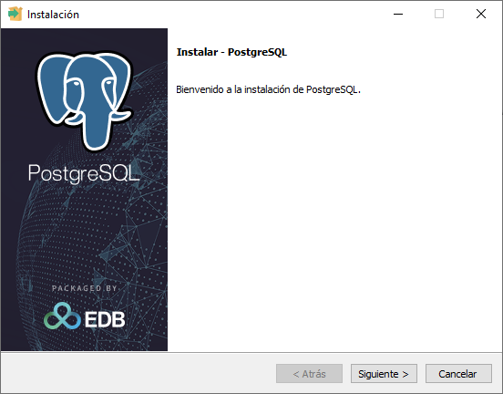
</p>


<br/>

#### Verificación:
- La ventana del instalador debe mostrar el logo de PostgreSQL y el elefante (mascota oficial).
- El título de la ventana debe indicar `PostgreSQL 18`.
- El botón `Next` debe estar habilitado.

<br/><br/>

### Paso 3. Configurar Directorio de Instalación

Seleccionar la ubicación donde se instalará PostgreSQL en el sistema.

1.	En la pantalla de bienvenida, haz clic en `Next`.
2.	En la pantalla `Installation Directory`, verás la ruta predeterminada:

    ```cmd 
    C:\Program Files\PostgreSQL\18
    ```

3.	**Recomendación**: Mantén la ruta predeterminada a menos que tengas una razón específica para cambiarla.
4.	Anota esta ruta, ya que la necesitarás para referencias futuras.
5.	Haz clic en `Next` para continuar.

#### Salida Esperada:

La siguiente pantalla debe mostrar la ruta de los componentes a instalar.

<p align="center">
  
</p>


#### Verificación:
- Confirma que la ruta de instalación es accesible.
- Verifica que hay suficiente espacio en el disco seleccionado (mínimo 2 GB).

<br/><br/>

### Paso 4. Seleccionar Componentes de Instalación
Elegir los componentes de PostgreSQL que se instalarán en el sistema.

1.	En la pantalla **Select Components**, verás las siguientes opciones:
    - **PostgreSQL Server** (servidor de base de datos).
    - **pgAdmin 4** (herramienta de administración gráfica).
    - **Stack Builder** (herramienta para descargar componentes adicionales).
    - **Command Line Tools** (herramientas de línea de comandos).
2.	Asegúrate de que TODOS los componentes estén seleccionados (marcados con check).
3.	Verifica especialmente que pgAdmin 4 esté seleccionado, ya que es esencial para este curso.
4.	Haz clic en **Next** para continuar.


#### Salida Esperada:
La siguiente pantalla lista los componentes a instalar.

<p align="center">
  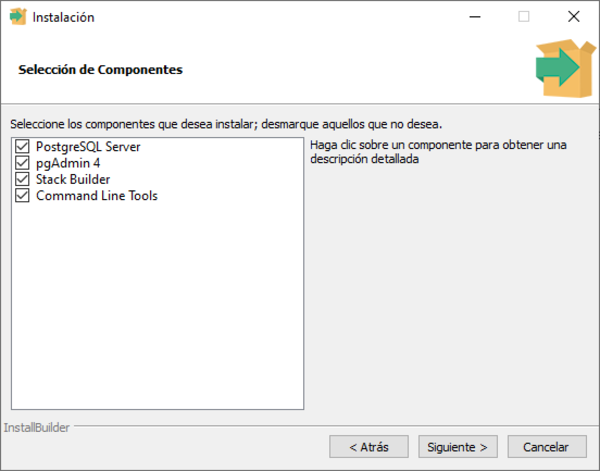
</p>

#### Verificación:
- Todos los componentes deben tener una marca de verificación.
- El espacio requerido mostrado debe ser aproximadamente 2 GB.

<br/><br/>

### Paso 5. Configurar Directorio de Datos
Establecer la ubicación donde PostgreSQL almacenará las bases de datos.

1.	En la pantalla `Data Directory`, verás la ruta predeterminada:

    ```cmd
    C:\Program Files\PostgreSQL\18\data
    ```

2.	**Recomendación:** Mantén esta ubicación predeterminada para simplificar la gestión.
3.	**Nota importante:** Este directorio contendrá todas tus bases de datos. Asegúrate de que el disco tenga suficiente espacio para crecimiento futuro.
4.	Haz clic en **Next** para continuar.


#### Salida Esperada:
La siguiente pantalla debe solicitar la ruta predeterminada para la instalación del software.

<p align="center">
  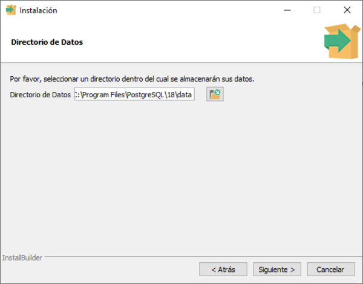
</p>

#### Verificación:
- La ruta del directorio de datos debe estar dentro de la carpeta de instalación de PostgreSQL.
- Confirma que el disco tiene al menos 5 GB libres para futuras bases de datos.

<br/><br/>

### Paso 6. Establecer Contraseña del Superusuario
Configurar una contraseña segura para el usuario administrador `postgres`.

1.	En la pantalla **Password**, verás dos campos para ingresar la contraseña.
2.	En el campo **Password**, ingresa una contraseña segura:
    - Mínimo 8 caracteres
    - Combina letras mayúsculas, minúsculas, números y símbolos
    - Ejemplo sugerido para laboratorio: `Admin2026!`
3.	En el campo **Retype Password**, ingresa exactamente la misma contraseña.
4.	**MUY IMPORTANTE:** Anota esta contraseña en un lugar seguro. La necesitarás constantemente.
    ```cmd
    Usuario: postgres
    Contraseña: [Tu contraseña elegida]
    ```
5.	Haz clic en **Next** para continuar.


#### Salida Esperada:
Si las contraseñas coinciden, avanzarás a la pantalla de configuración del puerto.

<p align="center">
  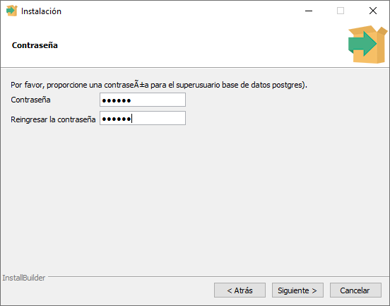
</p>

#### Verificación:
- Ambos campos de contraseña deben tener el mismo valor.
- Debes tener la contraseña anotada y guardada de forma segura.
- No uses contraseñas obvias como `123456` o `password` en ambientes productivos.


<br/><br/>

### Paso 7. Configurar Puerto de Conexión
Establecer el puerto TCP/IP que PostgreSQL utilizará para recibir conexiones.

1.	En la pantalla **Port**, verás el puerto predeterminado:
    ```cmd
    5432
    ```
2.	Recomendación: Mantén el puerto `5432` (puerto estándar de PostgreSQL).
3.	Nota: Solo cambia este puerto si ya tienes otra instancia de PostgreSQL ejecutándose o si el puerto 5432 está en uso por otra aplicación.
4.	Para verificar si el puerto está disponible, puedes ejecutar (en PowerShell):

    ```cmd
    netstat -an | findstr :5432
    ```

5.	Si no hay salida, el puerto está libre. Haz clic en **Next** para continuar.

#### Salida Esperada:
La siguiente pantalla debe solicitar el número del puerto.

<p align="center">
  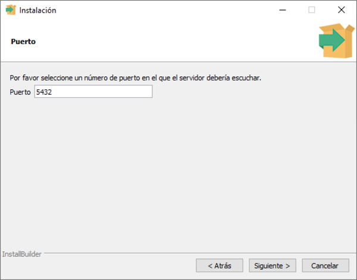
</p>

#### Verificación:
- El puerto debe ser 5432 (estándar).
- El comando netstat no debe mostrar ninguna conexión existente en ese puerto.

<br/><br/>

### Paso 8. Configurar Locale (Configuración Regional)
Establecer la configuración regional para ordenamiento y formato de datos.

1.	En la pantalla `Advanced Options - Locale`, verás un menú desplegable con opciones de locale.
2.	Recomendación: Selecciona `Spanish, Spain` o `Spanish, [Tu-País]` según tu ubicación.
3.	Alternativa: Puedes seleccionar `[Default locale]` para usar la configuración de Windows.
4.	Esta configuración afecta:
    - Ordenamiento de texto (collation)
    - Formato de fechas y números
    - Mensajes del sistema
5.	Haz clic en `Next` para continuar.


#### Salida Esperada:
Debe aparecer las opciones para seleccionar la región.

<p align="center">
  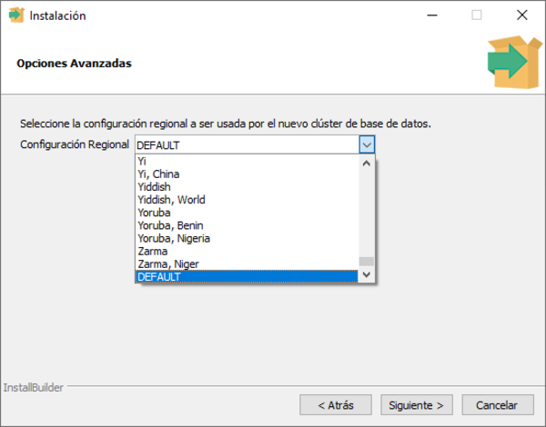
</p>

<br/>
Debe aparecer una pantalla de resumen mostrando todas las opciones de instalación configuradas.

<p align="center">
  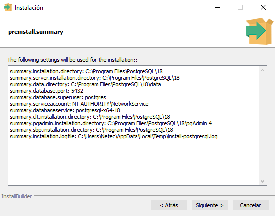
</p>

#### Verificación:
- El locale seleccionado debe corresponder a tu región o idioma preferido
- La configuración será visible en el resumen de instalación

<br/><br/>

### Paso 9. Revisar Resumen e Iniciar Instalación
Verificar todas las configuraciones antes de proceder con la insstalación.

1.	En la pantalla `Pre Installation Summary`, revisa cuidadosamente:
    - **Installation Directory:** C:\Program Files\PostgreSQL\18
    - **Server Port:** 5432
    - **Database Superuser:** postgres
    - **Components:** PostgreSQL Server, pgAdmin 4, Stack Builder, Command Line Tools
2.	Si todo es correcto, haz clic en `Next` para iniciar la instalación.
3.	En la pantalla `Ready to Install`, haz clic en `Next` nuevamente.
4.	El proceso de instalación comenzará. Verás una barra de progreso mostrando:
    - Copiando archivos
    - Instalando componentes
    - Configurando servicios
    - Inicializando base de datos
5.	Este proceso puede tomar 5-10 minutos. No cierres la ventana ni apagues el computador.


#### Salida Esperada:
Una barra de progreso debe mostrar el avance de la instalación, pasando por diferentes fases hasta completarse al 100%.

<p align="center">
  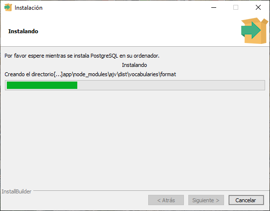
</p>


<br/><br/>

<p align="center">
  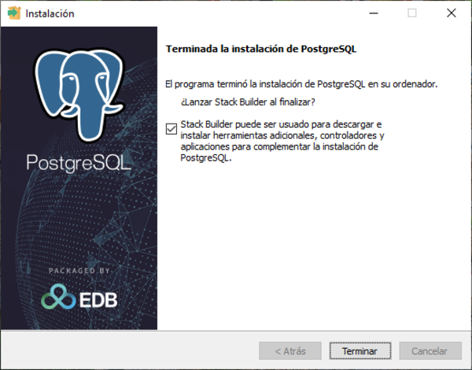
</p>

#### Verificación:

- La barra de progreso debe avanzar sin errores.
- No deben aparecer mensajes de error en rojo.
- El proceso debe completarse mostrando **Installation completed successfully**.


<br/><br/>


### Paso 10. Finalizar Instalación de PostgreSQL
Completar la instalación y verificar que el servicio de PostgreSQL esté ejecutándose.

1.	Cuando la instalación termine, verás la pantalla  **Completing the PostgreSQL Setup Wizard**.
2.	Desmarca la opción **Launch Stack Builder at exit** (no lo necesitamos ahora).
3.	Haz clic en **Finish** para cerrar el instalador.
4.	Verifica que el servicio de PostgreSQL esté ejecutándose. Abre PowerShell como administrador:

    ```cmd
    # Verificar estado del servicio PostgreSQL
    Get-Service -Name postgresql-x64-18
    ```

5.	Alternativamente, usa la interfaz gráfica de Servicios:

    ```cmd
    # Abrir el administrador de servicios
    services.msc
    ```

6.	Busca el servicio **postgresql-x64-18** y verifica que su estado sea `Running` (En ejecución).


#### Salida Esperada:
 
<p align="center">
  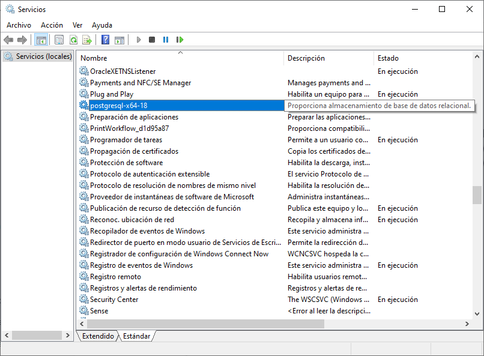
</p>

<br/>

<p align="center">
  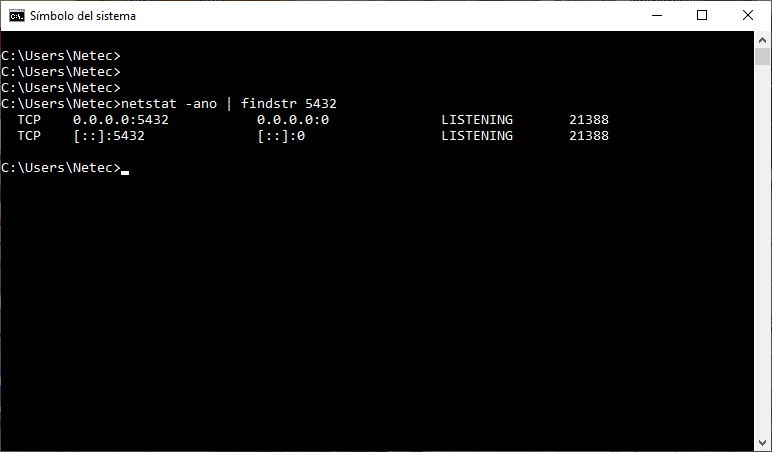
</p>

#### Verificación:
- El servicio postgresql-x64-18 debe estar en estado `Running`
- El tipo de inicio debe ser `Automatic` (Automático)
- Si ejecutas `netstat -an | findstr :5432`, debes ver el puerto escuchando

<br/><br/>

### Paso 11: Verificar Instalación con psql
Confirmar que PostgreSQL está funcionando correctamente mediante la herramienta de línea de comandos.

1.	Abre el Símbolo del sistema (CMD) o PowerShell.

2.	Navega al directorio bin de PostgreSQL:
    ```cmd
    cd "C:\Program Files\PostgreSQL\18\bin"
    ```

3.	Ejecuta el cliente de línea de comandos psql:
    ```cmd
    psql -U postgres
    ```

4.	Cuando se te solicite, ingresa la contraseña que configuraste en el Paso 6.

5.	Si la conexión es exitosa, verás el prompt de PostgreSQL:
    ```cmd
    psql (18.x)
    Type "help" for help.

    postgres=#
    ```

6.	Ejecuta un comando simple para verificar:
    ```sql
    SELECT version();
    ```

7.	Para salir de psql, escribe:
    ```cmd
    \q
    ```

#### Salida Esperada:

<p align="center">
  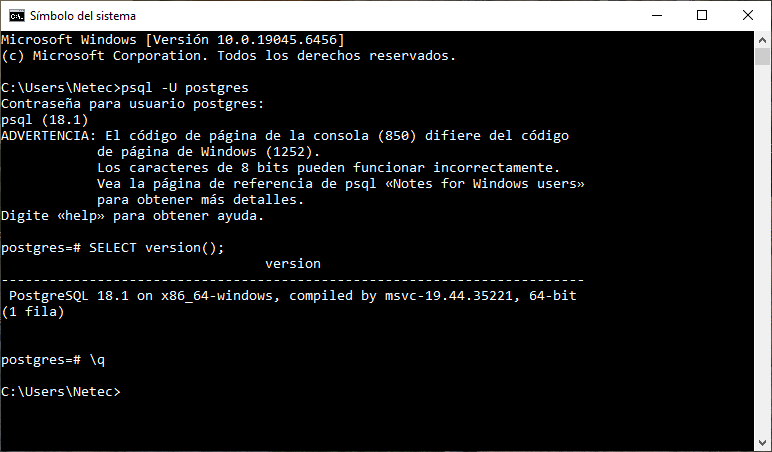
</p>

#### Verificación:
- Debes poder conectarte sin errores de autenticación.
- El comando `SELECT version();` debe mostrar **PostgreSQL 18.x**.
- El prompt debe cambiar a `postgres=#` indicando conexión exitosa.

<br/><br/>


### Paso 12. Instalar y Configurar PgAdmin 4

Configurar la herramienta gráfica de administración `PgAdmin 4` que se instaló junto con PostgreSQL.

1.	Abre el menú Inicio de Windows y busca **pgAdmin 4**.

2.	Haz clic en **pgAdmin 4** para iniciar la aplicación.

3.	Primera ejecución: **PgAdmin 4** se abrirá en tu navegador web predeterminado.

4.	Se te solicitará establecer una Master Password (contraseña maestra):
    - Esta contraseña protege las credenciales guardadas en **PgAdmin**
    - Puede ser la misma que usaste para postgres o una diferente.
        - Ejemplo: `MasterPgAdmin2024!`
        - Anota esta contraseña.
5.	Ingresa la Master Password dos veces y haz clic en **OK**.

6.	**PgAdmin 4** cargará su interfaz principal. Verás el panel de navegación a la izquierda con una estructura de árbol.


#### Salida Esperada:

La interfaz de PgAdmin 4 debe cargarse en tu navegador mostrando:
- Panel de navegación izquierdo (Browser)
- Panel central (Dashboard)
- Menú superior con opciones (File, Object, Tools, Help)


<p align="center">
  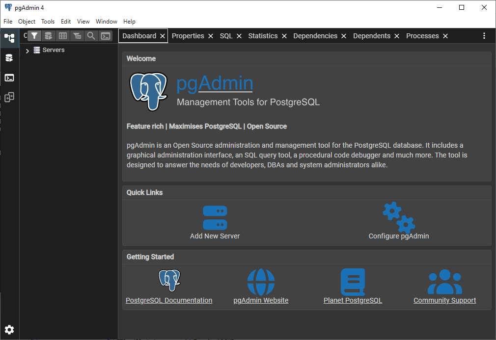
</p>


#### Verificación:
- **PgAdmin 4** debe abrir sin errores.
- No deben aparecer mensajes de error en pantalla.


<br/><br/>


### Paso 13: Registrar Servidor PostgreSQL en PgAdmin
Crear una conexión entre PgAdmin 4 y el servidor PostgreSQL local.

1.	En el panel izquierdo de PgAdmin, expande el nodo `Servers` haciendo clic en la flecha.

2.	Haz clic derecho sobre `Servers` y selecciona:
    - Create → Server...

3.	En la ventana emergente `Create - Server`, pestaña **General**:
    - **Name:** PostgreSQL 18 Local
    - **Comment (opcional):** Servidor local para curso de bases de datos

4. Cambia a la pestaña **Connection**:
    - **Host name/address**: localhost
    - **Port**: 5432
    - **Maintenance database**: postgres
    - **Username**: postgres
    - **Password**: [La contraseña que configuraste en el Paso 6]
    - **Save password**: ✓ (marca esta opción)

5.	Haz clic en **Save**.
6.	Si la configuración es correcta, el servidor aparecerá en el panel izquierdo bajo **Servers**.


#### Salida Esperada:

En el panel izquierdo debes ver:

<p align="center">
  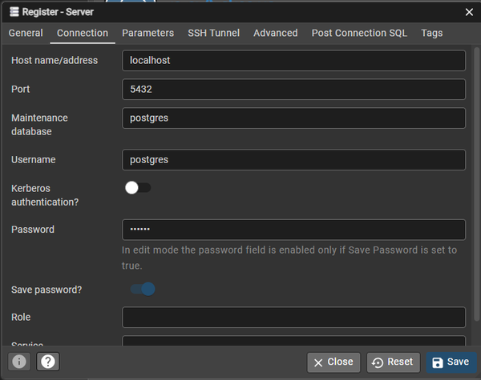
</p>

 

<br/><br/>

<p align="center">
  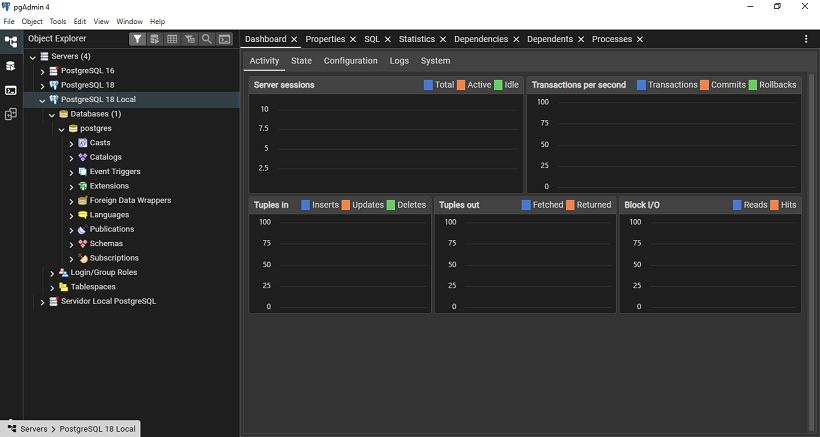
</p>


#### Verificación:
- El servidor debe aparecer con un ícono de elefante verde (conectado).
- Al expandir **Databases**, debes ver al menos la base de datos **postgres**.
- No deben aparecer errores de conexión.


<br/><br/>

### Paso 14. Explorar la Interfaz de PgAdmin
Familiarizarse con los componentes principales de la interfaz de **PgAdmin 4**.

1.	**Panel de Navegación (Browser)**: Lado izquierdo
    - Muestra la estructura jerárquica de servidores, bases de datos, esquemas, tablas, etc.
    - Expande el nodo **PostgreSQL 18 Local** → **Databases** → **postgres**.

2.	**Panel de Propiedades**: Parte superior central
    - Muestra información del objeto seleccionado.
    - Selecciona la base de datos **postgres** para ver sus propiedades.

3.	**Dashboard**: Centro
    - Muestra estadísticas del servidor (conexiones, transacciones, etc.)
    - Gráficos de actividad del servidor

4.	**Query Tool**: Herramienta para ejecutar consultas SQL
    - Haz clic derecho sobre la base de datos **postgres**
    - Selecciona `Query Tool`
    - Se abrirá un editor SQL

5.	Prueba ejecutar una consulta simple en el Query Tool:
    ```sql
    SELECT current_database(), current_user, version();
    ```
6.	Haz clic en el botón **Execute/Refresh** (ícono de play ▶) o presiona F5.


#### Salida Esperada:
La consulta debe ejecutarse y mostrar resultados en la parte inferior:

<p align="center">
  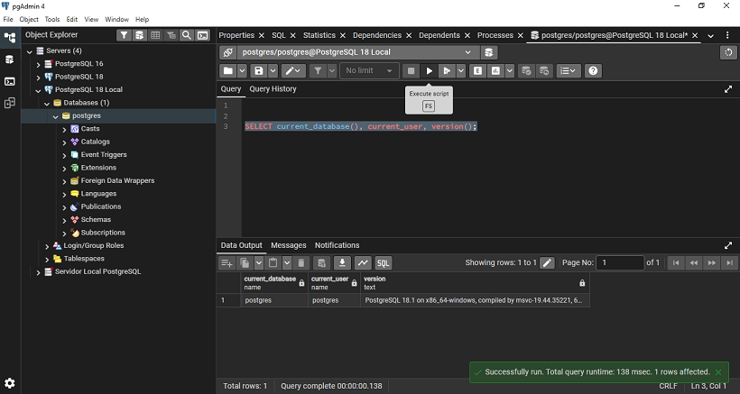
</p>

#### Verificación:
- El Query Tool debe abrir sin errores.
- La consulta debe ejecutarse exitosamente.
- Los resultados deben mostrarse en formato de tabla.
- El tiempo de ejecución debe aparecer en la parte inferior.

<br/><br/>

### Paso 15. Crear Base de Datos de Prueba

Verificar la capacidad de crear y gestionar bases de datos usando PgAdmin.

1.	En el panel izquierdo, haz clic derecho sobre **Databases** bajo tu servidor.

2.	Selecciona **Create** → **Database...**

3.	En la ventana **Create - Database**, pestaña **General**:

    - **Database**: laboratorio_prueba
    - **Owner**: postgres
    - **Comment**: Base de datos de prueba para verificar instalación

4.	Haz clic en **Save**.

5.	La nueva base de datos debe aparecer en la lista de bases de datos.

6.	Haz clic derecho sobre **laboratorio_prueba** y selecciona **Query Tool**.

7.	Ejecuta el siguiente script SQL para crear una tabla de prueba:

```sql
   -- Crear tabla de prueba
   CREATE TABLE prueba_instalacion (
       id SERIAL PRIMARY KEY,
       nombre VARCHAR(100),
       fecha_creacion TIMESTAMP DEFAULT CURRENT_TIMESTAMP
   );

   -- Insertar datos de prueba
   INSERT INTO prueba_instalacion (nombre)
   VALUES ('PostgreSQL 18 instalado correctamente');

   -- Consultar datos
   SELECT * FROM prueba_instalacion;
```

8.	Ejecuta el script completo haciendo clic en el botón Execute (F5).


#### Salida Esperada:

 
<p align="center">
  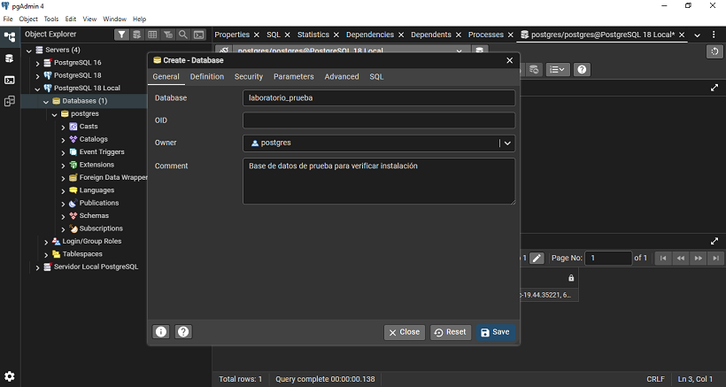
</p>

<br/><br/>

<p align="center">
  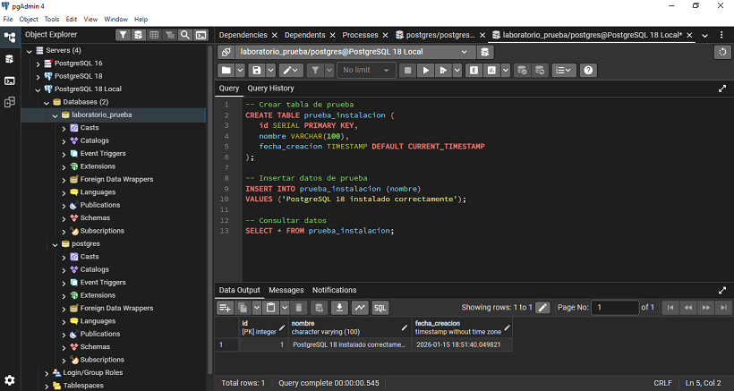
</p>

#### Verificación:
- La base de datos `laboratorio_prueba` debe aparecer en el Browser.
- La tabla debe crearse sin errores.
- La consulta `SELECT` debe devolver 1 fila con los datos insertados.
- La `fecha_creacion` debe mostrar la fecha y hora actual.


<br/><br/>

### Paso 16. Verificar Configuración del Sistema

Confirmar que todos los componentes están correctamente configurados y accesibles.

1.	Verifica las variables de entorno de PostgreSQL. Abre PowerShell:
```cmd
   # Ver variables de entorno relacionadas con PostgreSQL
   Get-ChildItem Env: | Where-Object {$_.Name -like "*PG*" -or $_.Name -like "*POSTGRES*"}
```

2.	Verifica la ruta de instalación en PATH (opcional pero recomendado):
```cmd
   # Ver si PostgreSQL está en el PATH
   $env:Path -split ';' | Select-String -Pattern "PostgreSQL"
```

3.	Verifica los archivos de configuración principales:
```cmd
   # Listar archivos de configuración
   Get-ChildItem "C:\Program Files\PostgreSQL\18\data" -Filter *.conf
```

4.	Debes ver archivos como:
    - postgresql.conf (configuración principal)
    - pg_hba.conf (autenticación)
    - pg_ident.conf (mapeo de usuarios)

5.	Verifica el log de PostgreSQL para asegurar que no hay errores:
```cmd
   # Ver últimas líneas del log
   Get-Content "C:\Program Files\PostgreSQL\18\data\log\*.log" -Tail 10
```

#### Salida Esperada:
El log debe mostrar mensajes como:

<p align="center">
  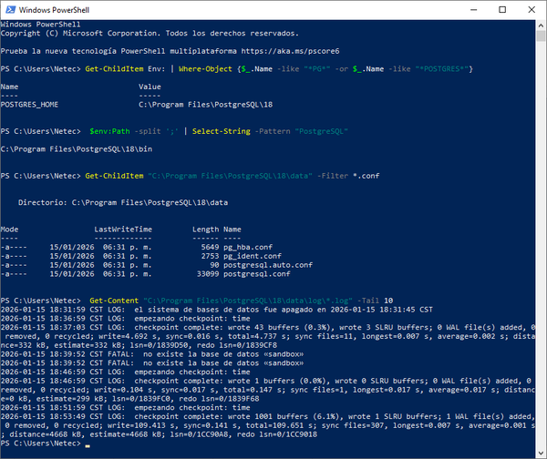
</p>

#### Verificación:
- No deben aparecer mensajes de ERROR o FATAL en el log
- Los archivos de configuración deben existir
- El servicio debe estar aceptando conexiones

<br/><br/>

## Validación y Pruebas
Criterios de Éxito

- PostgreSQL 18 está instalado en `C:\Program Files\PostgreSQL\18`
- El servicio `postgresql-x64-18` está ejecutándose y configurado como automático.
- PgAdmin 4 se abre correctamente.
- La conexión entre `PgAdmin` y `PostgreSQL` funciona sin errores.
- Se puede crear bases de datos, tablas e insertar datos exitosamente.
- El puerto `5432` está escuchando conexiones.
- El usuario `postgres` puede autenticarse con la contraseña configurada.
- Los archivos de log no muestran errores críticos.

## Procedimiento de Prueba
1.	Prueba de Conectividad desde Línea de Comandos:

```cmd
   cd "C:\Program Files\PostgreSQL\18\bin"
   psql -U postgres -c "SELECT 'Conexión exitosa' AS resultado;"
```

#### Resultado Esperado

```cmd
      resultado
   ------------------
    Conexión exitosa
   (1 row)
```

2.	Prueba de Conectividad desde PgAdmin:
    - Abre **PgAdmin 4**.
    - Expande el servidor **PostgreSQL 18 Local**.
    - El ícono debe ser verde (conectado).
    - Abre Query Tool y ejecuta:

```sql
   SELECT
       current_database() AS base_datos,
       current_user AS usuario,
       inet_server_addr() AS direccion_servidor,
       inet_server_port() AS puerto,
       pg_postmaster_start_time() AS hora_inicio_servidor;
```

#### Resultado Esperado
Debe devolver información del servidor sin errores.

3.	Prueba de Operaciones CRUD:
Ejecuta en Query Tool:
```sql
   -- Crear esquema de prueba
   CREATE SCHEMA IF NOT EXISTS validacion;

   -- Crear tabla
   CREATE TABLE validacion.test (
       id SERIAL PRIMARY KEY,
       dato TEXT
   );

   -- Insertar
   INSERT INTO validacion.test (dato) VALUES ('Prueba INSERT');

   -- Leer
   SELECT * FROM validacion.test;

   -- Actualizar
   UPDATE validacion.test SET dato = 'Prueba UPDATE' WHERE id = 1;

   -- Verificar
   SELECT * FROM validacion.test;

   -- Eliminar
   DELETE FROM validacion.test WHERE id = 1;

   -- Limpiar
   DROP SCHEMA validacion CASCADE;
```

#### Resultado Esperado

Todas las operaciones deben completarse sin errores.


4.	Prueba de Rendimiento Básico:

```sql
   -- Crear tabla con datos de prueba
   CREATE TABLE benchmark (
       id SERIAL PRIMARY KEY,
       valor NUMERIC,
       texto VARCHAR(100)
   );

   -- Insertar 10000 registros
   INSERT INTO benchmark (valor, texto)
   SELECT
       random() * 1000,
       'Registro ' || generate_series
   FROM generate_series(1, 10000);

   -- Consulta con agregación
   SELECT
       COUNT(*) AS total_registros,
       AVG(valor) AS promedio,
       MIN(valor) AS minimo,
       MAX(valor) AS maximo
   FROM benchmark;

   -- Limpiar
   DROP TABLE benchmark;
```

#### Resultado Esperado

Las operaciones deben completarse en menos de 5 segundos.


<br/><br/>

## Solución de Problemas

### **Problema 1.** El Servicio PostgreSQL No Inicia

**Síntomas:**
    - Mensaje de error: **could not start service postgresql-x64-18**
    - El servicio aparece como **Stopped** en services.msc
    - PgAdmin no puede conectarse al servidor

**Causa:**
El puerto 5432 puede estar ocupado por otra aplicación, o hay problemas con los permisos del directorio de datos.

**Solución:**
```cmd
# Verificar si el puerto está en uso
netstat -ano | findstr :5432

# Si hay un proceso usando el puerto, identificarlo
# PID aparecerá en la última columna del comando anterior
tasklist | findstr [PID]

# Verificar permisos del directorio de datos
icacls "C:\Program Files\PostgreSQL\18\data"

# Intentar iniciar el servicio manualmente
net start postgresql-x64-18

# Ver detalles del error en el log
Get-Content "C:\Program Files\PostgreSQL\18\data\log\*.log" -Tail 50
```

Si el problema persiste, reinstala PostgreSQL seleccionando un puerto diferente (ej: 5433).

<br/><br/>


### **Problema 2.** Error de Autenticación en PgAdmin

**Síntomas:**
    - Mensaje: **FATAL: password authentication failed for user postgres**
    - No se puede conectar al servidor desde PgAdmin
    - El ícono del servidor aparece con una X roja

**Causa:**
La contraseña ingresada no coincide con la configurada durante la instalación, o hay problemas con el archivo pg_hba.conf.

**Solución:**

```cmd
# Opción 1: Resetear contraseña usando psql
cd "C:\Program Files\PostgreSQL\18\bin"
psql -U postgres

# Si psql funciona, cambiar contraseña:
# ALTER USER postgres WITH PASSWORD 'NuevaContraseña2024!';
```

Si no puedes acceder con psql:

```cmd
# Opción 2: Modificar pg_hba.conf temporalmente
# 1. Detener el servicio
net stop postgresql-x64-18

# 2. Editar el archivo (como administrador)
notepad "C:\Program Files\PostgreSQL\18\data\pg_hba.conf"

# 3. Cambiar la línea:
# host    all             all             127.0.0.1/32            scram-sha-256
# Por:
# host    all             all             127.0.0.1/32            trust

# 4. Iniciar el servicio
net start postgresql-x64-18

# 5. Conectar con psql y cambiar contraseña
psql -U postgres
# ALTER USER postgres WITH PASSWORD 'NuevaContraseña2024!';

# 6. Revertir pg_hba.conf a scram-sha-256 y reiniciar servicio
```

<br/><br/>

### **Problema 3.** PgAdmin No Abre o Muestra Pantalla en Blanco


**Síntomas:**
    - Al hacer clic en PgAdmin 4, no pasa nada
    - El navegador abre pero muestra página en blanco
    - Error: **Unable to connect to server**

**Causa:**
El servidor web interno de PgAdmin no está iniciando correctamente, o hay conflictos con el navegador.

**Solución:**
```cmd
# Verificar si el proceso de PgAdmin está ejecutándose
Get-Process | Where-Object {$_.ProcessName -like "*pgAdmin*"}

# Terminar procesos de PgAdmin
Stop-Process -Name "pgAdmin4" -Force

# Eliminar archivos de configuración temporales
Remove-Item "$env:APPDATA\pgAdmin\*" -Recurse -Force

# Reiniciar PgAdmin desde línea de comandos para ver errores
cd "C:\Program Files\PostgreSQL\18\pgAdmin 4\bin"
.\pgAdmin4.exe
```

**Alternativas:**
    - Intenta abrir PgAdmin en un navegador diferente (Chrome, Firefox, Edge)
    - Verifica que no haya firewall bloqueando la aplicación
    - Reinstala solo PgAdmin usando el instalador independiente desde pgadmin.org

<br/><br/>

### **Problema 4.** Error "Role postgres does not exist"

**Síntomas:**
•	Mensaje al intentar conectar: **FATAL: role 'postgres' does not exist**
•	No se puede autenticar con el usuario postgres

**Causa:**
La base de datos no fue inicializada correctamente durante la instalación.

**Solución:**
```cmd
cd "C:\Program Files\PostgreSQL\18\bin"

REM Verificar si el cluster de base de datos existe
dir "C:\Program Files\PostgreSQL\18\data\base"

REM Si no existe, inicializar el cluster
initdb -D "C:\Program Files\PostgreSQL\18\data" -U postgres -W -E UTF8 -A scram-sha-256

REM Iniciar el servicio
net start postgresql-x64-18
```

<br/><br/>

### **Problema 5.** Puerto 5432 Ya Está en Uso

**Síntomas:**
    - Instalación falla con mensaje sobre puerto en uso
    - Servicio no inicia: **could not bind IPv4 address**

**Causa:**
Otra instancia de PostgreSQL u otra aplicación está usando el puerto 5432.

**Solución:**
```cmd
# Identificar qué proceso usa el puerto
netstat -ano | findstr :5432

# Obtener detalles del proceso (reemplaza PID con el número obtenido)
tasklist /FI "PID eq [PID]"

# Opción 1: Detener el proceso conflictivo
Stop-Process -Id [PID] -Force

# Opción 2: Configurar PostgreSQL para usar otro puerto
# Editar postgresql.conf
notepad "C:\Program Files\PostgreSQL\18\data\postgresql.conf"

# Cambiar la línea:
# port = 5432
# Por:
# port = 5433

# Reiniciar servicio
net stop postgresql-x64-18
net start postgresql-x64-18
```

> **Nota:** Si cambias el puerto, deberás actualizar la configuración en `PgAdmin` también.

<br/><br/>

## Limpieza

> **Advertencia:** Esta sección es solo para referencia. NO ejecutes estos comandos a menos que quieras desinstalar PostgreSQL completamente. Mantén tu instalación para los siguientes laboratorios.

Si necesitas desinstalar PostgreSQL en el futuro:

```cmd
# Detener el servicio
net stop postgresql-x64-18

# Desinstalar usando el Panel de Control
# O ejecutar el desinstalador:
Start-Process "C:\Program Files\PostgreSQL\18\uninstall-postgresql.exe"

# Eliminar directorios residuales (después de desinstalar)
Remove-Item "C:\Program Files\PostgreSQL" -Recurse -Force
Remove-Item "$env:APPDATA\pgAdmin" -Recurse -Force

# Eliminar variables de entorno si fueron creadas
[Environment]::SetEnvironmentVariable("PGDATA", $null, "User")
```

Para eliminar solo la base de datos de prueba creada en este laboratorio:


```sql
-- Ejecutar en PgAdmin Query Tool conectado a la base de datos postgres
DROP DATABASE IF EXISTS laboratorio_prueba;
```

<br/><br/>

## Resumen

Lo que has logrado:

- Instalaste exitosamente PostgreSQL 18 en Windows
- Configuraste el servicio de PostgreSQL para iniciar automáticamente
- Instalaste y configuraste PgAdmin 4 como herramienta de administración
- Estableciste conexión entre PgAdmin y el servidor PostgreSQL
- Creaste tu primera base de datos y tabla de prueba
- Ejecutaste consultas SQL básicas exitosamente
- Verificaste que todos los componentes funcionan correctamente


<br/><br/>

## Conceptos Clave Aprendidos
- **PostgreSQL** es un sistema de gestión de bases de datos relacional robusto y de código abierto.
- El usuario **postgres** es el superusuario por defecto con todos los privilegios.
- El puerto **5432** es el puerto estándar para conexiones PostgreSQL.
- **PgAdmin 4** es una herramienta web que facilita la administración visual de bases de datos.
- El directorio de datos contiene todas las bases de datos y configuraciones.
- Los servicios de Windows permiten que PostgreSQL se ejecute automáticamente en segundo plano.


<br/><br/>

## Credenciales Importantes (Guarda Esta Información)

Servidor **PostgreSQL**:

| Campo                         | Valor                    |
|-------------------------------|--------------------------|
| Host                          | localhost                |
| Puerto                        | 5432                     |
| Usuario                       | postgres                 |
| Contraseña                    | [La que configuraste]    |
| Base de datos predeterminada  | postgres                 | 


<br/><br/>
## Recursos Adicionales

* **PostgreSQL – Documentación Oficial (v18)**  
  https://www.postgresql.org/docs/18/  
  Documentación completa con referencia detallada de comandos SQL, funciones internas y opciones de configuración del motor.

* **pgAdmin 4 – Documentación Oficial**  
  https://www.pgadmin.org/docs/pgadmin4/latest/  
  Guía completa para el uso de pgAdmin, incluyendo tutoriales paso a paso y ejemplos prácticos de administración.

* **PostgreSQL Tutorial**  
  https://www.postgresqltutorial.com/  
  Tutoriales prácticos con ejemplos de SQL, desde nivel básico hasta avanzado, enfocados en el aprendizaje progresivo.

* **PostgreSQL Wiki**  
  https://wiki.postgresql.org/  
  Recursos comunitarios, consejos de configuración, extensiones y mejores prácticas compartidas por usuarios expertos.

* **Stack Overflow – PostgreSQL Tag**  
  https://stackoverflow.com/questions/tagged/postgresql  
  Comunidad activa para resolver dudas técnicas, errores comunes y escenarios reales de producción.

* **Optimización de Rendimiento en PostgreSQL**  
  https://www.postgresql.org/docs/18/performance-tips.html  
  Guía oficial para optimizar consultas SQL, índices, memoria y parámetros de configuración del servidor.

* **pgExercises**  
  https://pgexercises.com/  
  Plataforma interactiva para practicar SQL en PostgreSQL mediante ejercicios progresivos con validación inmediata.
