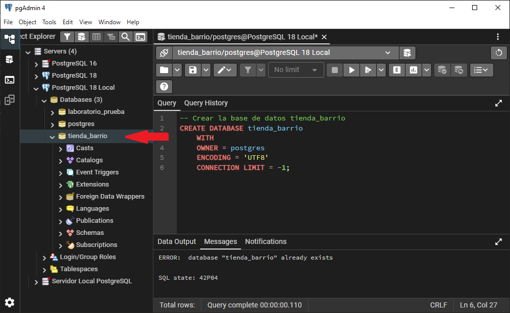
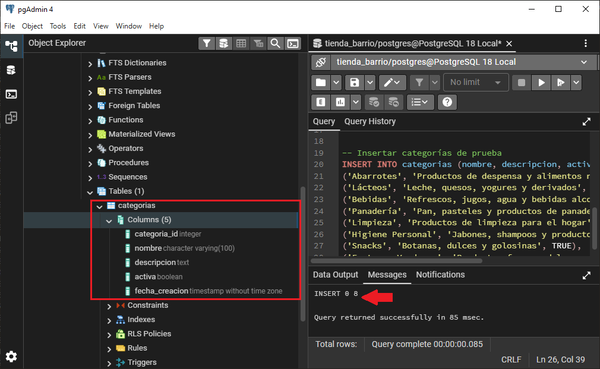
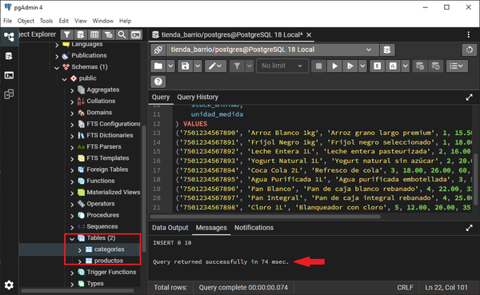
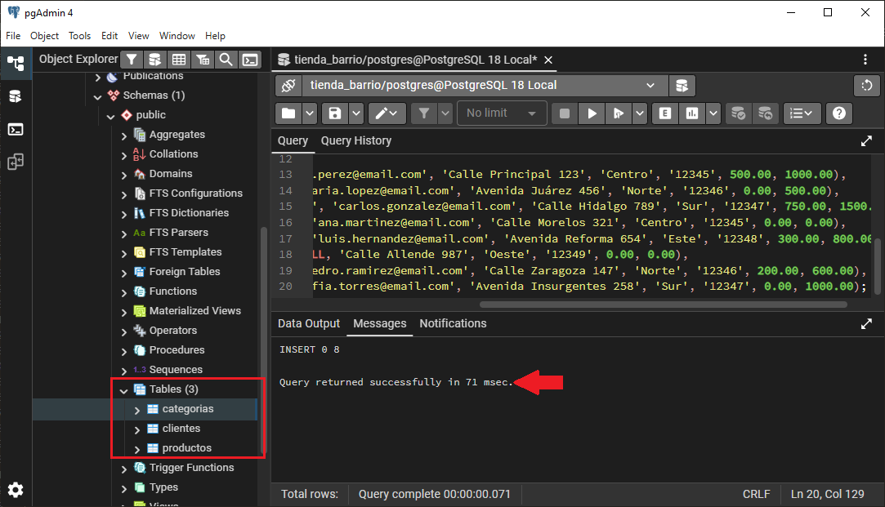
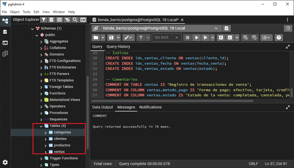
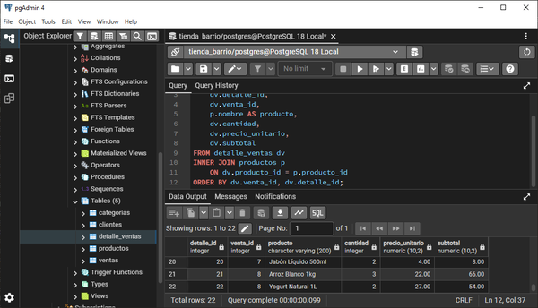
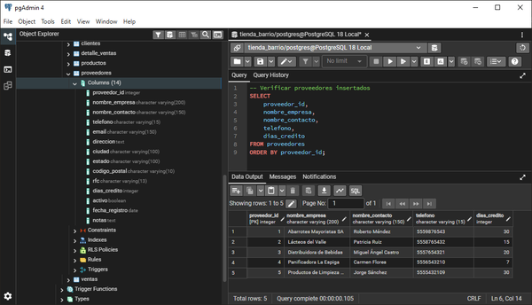
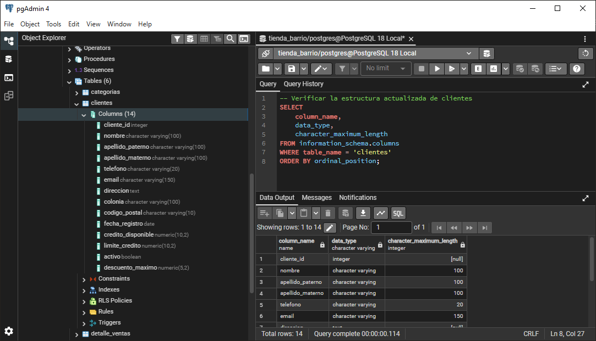

# Práctica: Creación de la base de datos diseñada en la práctica anterior

<br/><br/>

## Duración	
30 minutos

<br/><br/>

## Objetivos de Aprendizaje
Al completar este laboratorio, serás capaz de:

- Crear una base de datos nueva en PostgreSQL usando comandos DDL.
- Implementar tablas con tipos de datos apropiados de PostgreSQL (INTEGER, VARCHAR, NUMERIC, DATE, TIMESTAMP, BOOLEAN).
- Definir constraints de integridad, incluyendo PRIMARY KEY, FOREIGN KEY, NOT NULL, UNIQUE y CHECK.
- Establecer relaciones entre tablas mediante FOREIGN KEY, incorporando reglas ON DELETE y ON UPDATE.
- Insertar datos de prueba respetando la integridad referencial.
- Modificar estructuras de tablas existentes utilizando ALTER TABLE.

<br/><br/>

## Prerrequisitos

### Conocimientos Requeridos
- Diseño de base de datos de tienda de barrio completado (Lab 02)
- Comprensión de modelo entidad-relación y normalización
- Conocimiento básico de sintaxis SQL DDL
- Familiaridad con la interfaz de PgAdmin


### Acceso Requerido
- PostgreSQL 18.x instalado y en ejecución
- PgAdmin 4.x configurado y accesible
- Credenciales de usuario postgres o usuario con privilegios de creación de bases de datos
- Permisos de escritura en el sistema de archivos de PostgreSQL


### Entorno de Laboratorio

#### Requisitos de Hardware

| Componente   | Especificación                         |
|--------------|----------------------------------------|
| Procesador   | 64 bits (x86-64 o compatible)           |
| RAM          | Mínimo 4 GB (recomendado 8 GB)          |
| Disco Duro   | Mínimo 2 GB libres                      |
| Pantalla     | Resolución mínima 1280x720              |


#### Requisitos de Software

| Software        | Versión                              | Propósito                                   |
|-----------------|--------------------------------------|---------------------------------------------|
| PostgreSQL      | 18.x                                 | Sistema gestor de base de datos relacional  |
| PgAdmin         | 4.x (compatible con PostgreSQL 18)   | Interfaz gráfica de administración          |
| Windows         | 10 o 11 (64-bit)                     | Sistema operativo base                      |
| Navegador Web   | Chrome 90+, Firefox 88+, Edge 90+    | Para ejecutar PgAdmin 4                     |


#### Configuración Inicial

1. Verifica que PostgreSQL esté en ejecución:

```bash
# En Windows PowerShell o CMD
pg_ctl status -D "C:\Program Files\PostgreSQL\18\data"
```

2. Abre PgAdmin 4 desde el menú de inicio de Windows.

3. Conéctate al servidor PostgreSQL local utilizando tus credenciales.

<br/><br/>

## Instrucciones

### Paso 1. Crear la Base de Datos

Crear una nueva base de datos llamada **tienda_barrio** que alojará todas las tablas del sistema.

1. En PgAdmin, haz clic derecho sobre **Databases** en el panel izquierdo y selecciona **Create** → **Database...**.

2. En el cuadro de diálogo, ingresa el nombre de la base de datos:
   - Database: **tienda_barrio**
   - Owner: **postgres** (o tu usuario)
   - Encoding: **UTF8**
   - Collation: **Spanish_Spain.1252** (o **C**)

3. Haz clic en **Save**.

4. Alternativamente, puedes usar SQL. Haz clic en **Query Tool** y ejecuta:

```sql
-- Crear la base de datos tienda_barrio
CREATE DATABASE tienda_barrio
    WITH
    OWNER = postgres
    ENCODING = 'UTF8'
    CONNECTION LIMIT = -1;
```

<br/><br/>

#### Salida Esperada:



<br/><br/>

#### Verificación:
- La base de datos **tienda_barrio** aparece en el panel izquierdo bajo **"Databases"**.
- Puedes expandir el nodo y ver las carpetas **"Schemas"**, **"Extensions"**, etc.

<br/><br/>

### Paso 2. Crear la Tabla de Categorías

Implementar la tabla **categorias**, que servirá como catálogo de categorías de productos.

1. Haz clic derecho sobre la base de datos **tienda_barrio** y selecciona **"Query Tool"**.

2. Ejecuta el siguiente script DDL:

```sql
-- Tabla: categorias
-- Descripción: Almacena las categorías de productos disponibles en la tienda
CREATE TABLE categorias (
    categoria_id SERIAL PRIMARY KEY,
    nombre VARCHAR(100) NOT NULL UNIQUE,
    descripcion TEXT,
    activa BOOLEAN DEFAULT TRUE,
    fecha_creacion TIMESTAMP DEFAULT CURRENT_TIMESTAMP
);

-- Comentario de la tabla
COMMENT ON TABLE categorias IS 'Catálogo de categorías de productos';
COMMENT ON COLUMN categorias.categoria_id IS 'Identificador único de la categoría';
COMMENT ON COLUMN categorias.nombre IS 'Nombre de la categoría (único)';
COMMENT ON COLUMN categorias.activa IS 'Indica si la categoría está activa';
```

<br/><br/>

3.	Inserta datos de prueba:

```sql
-- Insertar categorías de prueba
INSERT INTO categorias (nombre, descripcion, activa) VALUES
('Abarrotes', 'Productos de despensa y alimentos no perecederos', TRUE),
('Lácteos', 'Leche, quesos, yogures y derivados', TRUE),
('Bebidas', 'Refrescos, jugos, agua y bebidas alcohólicas', TRUE),
('Panadería', 'Pan, pasteles y productos de panadería', TRUE),
('Limpieza', 'Productos de limpieza para el hogar', TRUE),
('Higiene Personal', 'Jabones, shampoos y productos de cuidado personal', TRUE),
('Snacks', 'Botanas, dulces y golosinas', TRUE),
('Frutas y Verduras', 'Productos frescos del campo', TRUE);
```

<br/><br/>

#### Salida Esperada:



<br/><br/>

#### Verificación:
- Ejecuta la consulta de verificación:

```sql
SELECT * FROM categorias ORDER BY categoria_id;
```

- Deberías ver 8 categorías con sus respectivos IDs, nombres y descripciones

<br/><br/>

### Paso 3. Crear la Tabla de Productos
Implementar la tabla productos con todos sus constraints y relación con categorias.

1.	En el Query Tool, ejecuta el siguiente script:

```sql
-- Tabla: productos
-- Descripción: Almacena información de los productos disponibles en la tienda

CREATE TABLE productos (
    producto_id SERIAL PRIMARY KEY,
    codigo_barras VARCHAR(50) UNIQUE,
    nombre VARCHAR(200) NOT NULL,
    descripcion TEXT,
    categoria_id INTEGER NOT NULL,
    precio_compra NUMERIC(10, 2) NOT NULL CHECK (precio_compra >= 0),
    precio_venta NUMERIC(10, 2) NOT NULL CHECK (precio_venta >= 0),
    stock_actual INTEGER NOT NULL DEFAULT 0 CHECK (stock_actual >= 0),
    stock_minimo INTEGER DEFAULT 5 CHECK (stock_minimo >= 0),
    unidad_medida VARCHAR(20) DEFAULT 'unidad',
    activo BOOLEAN DEFAULT TRUE,
    fecha_creacion TIMESTAMP DEFAULT CURRENT_TIMESTAMP,
    fecha_actualizacion TIMESTAMP DEFAULT CURRENT_TIMESTAMP,

    -- Constraint de integridad referencial

    CONSTRAINT fk_productos_categoria
        FOREIGN KEY (categoria_id)
        REFERENCES categorias(categoria_id)
        ON DELETE RESTRICT
        ON UPDATE CASCADE,

    -- Constraint adicional: precio de venta debe ser mayor que precio de compra

    CONSTRAINT chk_precio_venta_mayor
        CHECK (precio_venta > precio_compra)
);

-- Índices para mejorar rendimiento

CREATE INDEX idx_productos_categoria ON productos(categoria_id);
CREATE INDEX idx_productos_codigo_barras ON productos(codigo_barras);
CREATE INDEX idx_productos_nombre ON productos(nombre);

-- Comentarios

COMMENT ON TABLE productos IS 'Catálogo de productos disponibles en la tienda';
COMMENT ON COLUMN productos.codigo_barras IS 'Código de barras único del producto';
COMMENT ON COLUMN productos.stock_actual IS 'Cantidad actual en inventario';
COMMENT ON COLUMN productos.stock_minimo IS 'Nivel mínimo de stock para reorden';
```

<br/><br/>

2.	Inserta datos de prueba:

```sql
-- Insertar productos de prueba
INSERT INTO productos (
    codigo_barras,
    nombre,
    descripcion,
    categoria_id,
    precio_compra,
    precio_venta,
    stock_actual,
    stock_minimo,
    unidad_medida
) VALUES
('7501234567890', 'Arroz Blanco 1kg', 'Arroz grano largo premium', 1, 15.50, 22.00, 50, 10, 'kg'),
('7501234567891', 'Frijol Negro 1kg', 'Frijol negro seleccionado', 1, 18.00, 25.00, 40, 10, 'kg'),
('7501234567892', 'Leche Entera 1L', 'Leche entera pasteurizada', 2, 16.00, 22.50, 30, 15, 'litro'),
('7501234567893', 'Yogurt Natural 1L', 'Yogurt natural sin azúcar', 2, 20.00, 28.00, 25, 10, 'litro'),
('7501234567894', 'Coca Cola 2L', 'Refresco de cola', 3, 18.00, 26.00, 60, 20, 'litro'),
('7501234567895', 'Agua Purificada 1L', 'Agua purificada embotellada', 3, 5.00, 10.00, 100, 30, 'litro'),
('7501234567896', 'Pan Blanco', 'Pan de caja blanco rebanado', 4, 22.00, 32.00, 20, 10, 'pieza'),
('7501234567897', 'Pan Integral', 'Pan de caja integral rebanado', 4, 25.00, 35.00, 15, 10, 'pieza'),
('7501234567898', 'Cloro 1L', 'Blanqueador con cloro', 5, 12.00, 20.00, 35, 10, 'litro'),
('7501234567899', 'Jabón Líquido 500ml', 'Jabón líquido para manos', 6, 25.00, 38.00, 40, 15, 'ml');
```

<br/><br/>

#### Salida Esperada:



<br/><br/>

#### Verificación:

Verificar productos insertados con sus categorías

```sql
SELECT
    p.producto_id,
    p.codigo_barras,
    p.nombre,
    c.nombre AS categoria,
    p.precio_venta,
    p.stock_actual
FROM productos p
INNER JOIN categorias c
    ON p.categoria_id = c.categoria_id
ORDER BY p.producto_id;
```


<br/><br/>

### Paso 4. Crear la Tabla de Clientes
Implementar la tabla clientes para almacenar información de los clientes de la tienda.

1.	Ejecuta el siguiente script DDL:

```sql

-- Tabla: clientes
-- Descripción: Almacena información de los clientes de la tienda

CREATE TABLE clientes (
    cliente_id SERIAL PRIMARY KEY,
    nombre VARCHAR(100) NOT NULL,
    apellido_paterno VARCHAR(100) NOT NULL,
    apellido_materno VARCHAR(100),
    telefono VARCHAR(15),
    email VARCHAR(150) UNIQUE,
    direccion TEXT,
    colonia VARCHAR(100),
    codigo_postal VARCHAR(10),
    fecha_registro DATE DEFAULT CURRENT_DATE,
    credito_disponible NUMERIC(10, 2) DEFAULT 0.00 CHECK (credito_disponible >= 0),
    limite_credito NUMERIC(10, 2) DEFAULT 0.00 CHECK (limite_credito >= 0),
    activo BOOLEAN DEFAULT TRUE,

    -- Constraint: crédito disponible no puede exceder el límite
    CONSTRAINT chk_credito_limite
        CHECK (credito_disponible <= limite_credito)
);

-- Índices
CREATE INDEX idx_clientes_nombre ON clientes(nombre, apellido_paterno);
CREATE INDEX idx_clientes_telefono ON clientes(telefono);

-- Comentarios
COMMENT ON TABLE clientes IS 'Información de clientes de la tienda';
COMMENT ON COLUMN clientes.credito_disponible IS 'Crédito actual disponible para el cliente';
COMMENT ON COLUMN clientes.limite_credito IS 'Límite máximo de crédito autorizado';
```

<br/><br/>

2.	Inserta datos de prueba:

Insertar clientes de prueba

```sql
INSERT INTO clientes (
    nombre,
    apellido_paterno,
    apellido_materno,
    telefono,
    email,
    direccion,
    colonia,
    codigo_postal,
    credito_disponible,
    limite_credito
) VALUES
('Juan', 'Pérez', 'García', '5551234567', 'juan.perez@email.com', 'Calle Principal 123', 'Centro', '12345', 500.00, 1000.00),
('María', 'López', 'Martínez', '5552345678', 'maria.lopez@email.com', 'Avenida Juárez 456', 'Norte', '12346', 0.00, 500.00),
('Carlos', 'González', 'Rodríguez', '5553456789', 'carlos.gonzalez@email.com', 'Calle Hidalgo 789', 'Sur', '12347', 750.00, 1500.00),
('Ana', 'Martínez', 'Hernández', '5554567890', 'ana.martinez@email.com', 'Calle Morelos 321', 'Centro', '12345', 0.00, 0.00),
('Luis', 'Hernández', 'Sánchez', '5555678901', 'luis.hernandez@email.com', 'Avenida Reforma 654', 'Este', '12348', 300.00, 800.00),
('Laura', 'García', 'Ramírez', '5556789012', NULL, 'Calle Allende 987', 'Oeste', '12349', 0.00, 0.00),
('Pedro', 'Ramírez', 'Torres', '5557890123', 'pedro.ramirez@email.com', 'Calle Zaragoza 147', 'Norte', '12346', 200.00, 600.00),
('Sofia', 'Torres', 'Flores', '5558901234', 'sofia.torres@email.com', 'Avenida Insurgentes 258', 'Sur', '12347', 0.00, 1000.00);
```


<br/><br/>

#### Salida Esperada:



<br/><br/>

#### Verificación:

```sql
-- Verificar clientes insertados
SELECT
    cliente_id,
    nombre,
    apellido_paterno,
    telefono,
    credito_disponible,
    limite_credito
FROM clientes
ORDER BY cliente_id;
```

<br/><br/>

### Paso 5. Crear la Tabla de Ventas
Implementar la tabla ventas que registrará las transacciones de venta.

1.	Ejecuta el siguiente script:

```sql
-- Tabla: ventas
-- Descripción: Registra las transacciones de venta realizadas
CREATE TABLE ventas (
    venta_id SERIAL PRIMARY KEY,
    cliente_id INTEGER,
    fecha_venta TIMESTAMP DEFAULT CURRENT_TIMESTAMP,
    subtotal NUMERIC(10, 2) NOT NULL CHECK (subtotal >= 0),
    impuesto NUMERIC(10, 2) DEFAULT 0.00 CHECK (impuesto >= 0),
    descuento NUMERIC(10, 2) DEFAULT 0.00 CHECK (descuento >= 0),
    total NUMERIC(10, 2) NOT NULL CHECK (total >= 0),
    metodo_pago VARCHAR(20) NOT NULL
        CHECK (metodo_pago IN ('efectivo', 'tarjeta', 'credito', 'transferencia')),
    estado VARCHAR(20) DEFAULT 'completada'
        CHECK (estado IN ('completada', 'cancelada', 'pendiente')),
    notas TEXT,

    -- Foreign key a clientes (puede ser NULL para ventas sin cliente registrado)
    CONSTRAINT fk_ventas_cliente
        FOREIGN KEY (cliente_id)
        REFERENCES clientes(cliente_id)
        ON DELETE SET NULL
        ON UPDATE CASCADE,

    -- Constraint: total debe ser igual a subtotal + impuesto - descuento
    CONSTRAINT chk_total_correcto
        CHECK (total = subtotal + impuesto - descuento)
);

-- Índices
CREATE INDEX idx_ventas_cliente ON ventas(cliente_id);
CREATE INDEX idx_ventas_fecha ON ventas(fecha_venta);
CREATE INDEX idx_ventas_estado ON ventas(estado);

-- Comentarios
COMMENT ON TABLE ventas IS 'Registro de transacciones de venta';
COMMENT ON COLUMN ventas.metodo_pago IS 'Forma de pago: efectivo, tarjeta, credito, transferencia';
COMMENT ON COLUMN ventas.estado IS 'Estado de la venta: completada, cancelada, pendiente';
```

<br/><br/>

2.	Inserta datos de prueba:

```sql
-- Insertar ventas de prueba
INSERT INTO ventas (
    cliente_id,
    fecha_venta,
    subtotal,
    impuesto,
    descuento,
    total,
    metodo_pago,
    estado
) VALUES
(1, '2024-01-15 10:30:00', 100.00, 16.00, 0.00, 116.00, 'efectivo', 'completada'),
(1, '2024-01-16 14:20:00', 250.00, 40.00, 20.00, 270.00, 'tarjeta', 'completada'),
(2, '2024-01-17 09:15:00', 150.00, 24.00, 0.00, 174.00, 'efectivo', 'completada'),
(3, '2024-01-17 16:45:00', 500.00, 80.00, 50.00, 530.00, 'credito', 'completada'),
(NULL, '2024-01-18 11:00:00', 75.00, 12.00, 0.00, 87.00, 'efectivo', 'completada'),
(4, '2024-01-18 15:30:00', 200.00, 32.00, 10.00, 222.00, 'tarjeta', 'completada'),
(5, '2024-01-19 10:00:00', 300.00, 48.00, 0.00, 348.00, 'credito', 'completada'),
(NULL, '2024-01-19 17:20:00', 120.00, 19.20, 5.00, 134.20, 'efectivo', 'completada');
```


<br/><br/>

#### Salida Esperada:



<br/><br/>

#### Verificación:

```sql
-- Verificar ventas con información de clientes
SELECT
    v.venta_id,
    COALESCE(c.nombre || ' ' || c.apellido_paterno, 'Cliente General') AS cliente,
    v.fecha_venta,
    v.total,
    v.metodo_pago,
    v.estado
FROM ventas v
LEFT JOIN clientes c
    ON v.cliente_id = c.cliente_id
ORDER BY v.venta_id;
```

<br/><br/>

### Paso 6. Crear la Tabla de Detalle de Ventas
Implementar la tabla detalle_ventas que almacenará los productos vendidos en cada transacción.

1.	Ejecuta el siguiente script:

```sql
-- Tabla: detalle_ventas
-- Descripción: Almacena el detalle de productos vendidos en cada venta
CREATE TABLE detalle_ventas (
    detalle_id SERIAL PRIMARY KEY,
    venta_id INTEGER NOT NULL,
    producto_id INTEGER NOT NULL,
    cantidad INTEGER NOT NULL CHECK (cantidad > 0),
    precio_unitario NUMERIC(10, 2) NOT NULL CHECK (precio_unitario >= 0),
    subtotal NUMERIC(10, 2) NOT NULL CHECK (subtotal >= 0),

    -- Foreign keys
    CONSTRAINT fk_detalle_venta
        FOREIGN KEY (venta_id)
        REFERENCES ventas(venta_id)
        ON DELETE CASCADE
        ON UPDATE CASCADE,

    CONSTRAINT fk_detalle_producto
        FOREIGN KEY (producto_id)
        REFERENCES productos(producto_id)
        ON DELETE RESTRICT
        ON UPDATE CASCADE,

    -- Constraint: subtotal debe ser cantidad * precio_unitario
    CONSTRAINT chk_subtotal_correcto
        CHECK (subtotal = cantidad * precio_unitario),

    -- Constraint: no puede haber duplicados de producto en la misma venta
    CONSTRAINT uk_venta_producto
        UNIQUE (venta_id, producto_id)
);

-- Índices
CREATE INDEX idx_detalle_venta ON detalle_ventas(venta_id);
CREATE INDEX idx_detalle_producto ON detalle_ventas(producto_id);

-- Comentarios
COMMENT ON TABLE detalle_ventas IS 'Detalle de productos vendidos en cada transacción';
COMMENT ON COLUMN detalle_ventas.cantidad IS 'Cantidad de unidades vendidas';
COMMENT ON COLUMN detalle_ventas.precio_unitario IS 'Precio unitario al momento de la venta';
```

<br/><br/>

2.	Inserta datos de prueba (asegúrate de que correspondan con los subtotales de las ventas):

```sql
-- Insertar detalle de ventas (Venta 1: subtotal 100.00)
INSERT INTO detalle_ventas (venta_id, producto_id, cantidad, precio_unitario, subtotal) VALUES
(1, 1, 2, 22.00, 44.00),
(1, 5, 2, 26.00, 52.00),
(1, 10, 1, 4.00, 4.00);

-- Venta 2: subtotal 250.00
INSERT INTO detalle_ventas (venta_id, producto_id, cantidad, precio_unitario, subtotal) VALUES
(2, 3, 5, 22.50, 112.50),
(2, 4, 3, 28.00, 84.00),
(2, 7, 1, 32.00, 32.00),
(2, 9, 1, 20.00, 20.00);

-- Venta 3: subtotal 150.00
INSERT INTO detalle_ventas (venta_id, producto_id, cantidad, precio_unitario, subtotal) VALUES
(3, 2, 4, 25.00, 100.00),
(3, 6, 5, 10.00, 50.00);

-- Venta 4: subtotal 500.00
INSERT INTO detalle_ventas (venta_id, producto_id, cantidad, precio_unitario, subtotal) VALUES
(4, 1, 10, 22.00, 220.00),
(4, 2, 8, 25.00, 200.00),
(4, 5, 3, 26.00, 78.00),
(4, 10, 1, 2.00, 2.00);

-- Venta 5: subtotal 75.00
INSERT INTO detalle_ventas (venta_id, producto_id, cantidad, precio_unitario, subtotal) VALUES
(5, 8, 2, 35.00, 70.00),
(5, 6, 1, 5.00, 5.00);

-- Venta 6: subtotal 200.00
INSERT INTO detalle_ventas (venta_id, producto_id, cantidad, precio_unitario, subtotal) VALUES
(6, 3, 8, 22.50, 180.00),
(6, 9, 1, 20.00, 20.00);

-- Venta 7: subtotal 300.00
INSERT INTO detalle_ventas (venta_id, producto_id, cantidad, precio_unitario, subtotal) VALUES
(7, 5, 10, 26.00, 260.00),
(7, 7, 1, 32.00, 32.00),
(7, 10, 2, 4.00, 8.00);

-- Venta 8: subtotal 120.00
INSERT INTO detalle_ventas (venta_id, producto_id, cantidad, precio_unitario, subtotal) VALUES
(8, 1, 3, 22.00, 66.00),
(8, 4, 2, 27.00, 54.00);
```

<br/><br/>

#### Salida Esperada:



<br/><br/>


#### Verificación:

```sql
-- Verificar detalle de ventas con nombres de productos
SELECT
    dv.detalle_id,
    dv.venta_id,
    p.nombre AS producto,
    dv.cantidad,
    dv.precio_unitario,
    dv.subtotal
FROM detalle_ventas dv
INNER JOIN productos p
    ON dv.producto_id = p.producto_id
ORDER BY dv.venta_id, dv.detalle_id;
```

<br/><br/>

### Paso 7. Crear la Tabla de Proveedores
Implementar la tabla proveedores para gestionar información de los proveedores de la tienda.

1.	Ejecuta el siguiente script:

```sql
-- Tabla: proveedores
-- Descripción: Almacena información de los proveedores de productos
CREATE TABLE proveedores (
    proveedor_id SERIAL PRIMARY KEY,
    nombre_empresa VARCHAR(200) NOT NULL,
    nombre_contacto VARCHAR(150),
    telefono VARCHAR(15) NOT NULL,
    email VARCHAR(150),
    direccion TEXT,
    ciudad VARCHAR(100),
    estado VARCHAR(100),
    codigo_postal VARCHAR(10),
    rfc VARCHAR(13) UNIQUE,
    dias_credito INTEGER DEFAULT 0 CHECK (dias_credito >= 0),
    activo BOOLEAN DEFAULT TRUE,
    fecha_registro DATE DEFAULT CURRENT_DATE,
    notas TEXT
);

-- Índices
CREATE INDEX idx_proveedores_nombre ON proveedores(nombre_empresa);
CREATE INDEX idx_proveedores_rfc ON proveedores(rfc);

-- Comentarios
COMMENT ON TABLE proveedores IS 'Información de proveedores de productos';
COMMENT ON COLUMN proveedores.dias_credito IS 'Días de crédito otorgados por el proveedor';
COMMENT ON COLUMN proveedores.rfc IS 'Registro Federal de Contribuyentes (México)';
```

<br/><br/>

2.	Inserta datos de prueba:

```sql
-- Insertar proveedores de prueba
INSERT INTO proveedores (
    nombre_empresa,
    nombre_contacto,
    telefono,
    email,
    direccion,
    ciudad,
    estado,
    rfc,
    dias_credito
) VALUES
('Abarrotes Mayoristas SA', 'Roberto Méndez', '5559876543', 'ventas@abarrotes.com', 'Industrial 100', 'Ciudad de México', 'CDMX', 'AMA950101ABC', 30),
('Lácteos del Valle', 'Patricia Ruiz', '5558765432', 'contacto@lacteosval.com', 'Carretera Norte Km 5', 'Querétaro', 'Querétaro', 'LDV980215XYZ', 15),
('Distribuidora de Bebidas', 'Miguel Ángel Castro', '5557654321', 'pedidos@disbebidas.com', 'Boulevard Sur 250', 'Monterrey', 'Nuevo León', 'DBE000320MNO', 20),
('Panificadora La Espiga', 'Carmen Flores', '5556543210', 'ventas@laespiga.com', 'Calle Panaderos 45', 'Guadalajara', 'Jalisco', 'PLE010510PQR', 7),
('Productos de Limpieza Pro', 'Jorge Sánchez', '5555432109', 'info@limpiezapro.com', 'Zona Industrial 300', 'Puebla', 'Puebla', 'PLP020815STU', 30);
```


<br/><br/>

#### Salida Esperada:



<br/><br/>


#### Verificación:

```sql
-- Verificar proveedores insertados
SELECT
    proveedor_id,
    nombre_empresa,
    nombre_contacto,
    telefono,
    dias_credito
FROM proveedores
ORDER BY proveedor_id;
```

<br/><br/>

### Paso 8. Modificar Estructura con ALTER TABLE
Practicar modificaciones de estructura de tablas existentes agregando nuevas columnas y constraints.

1.	Agregar una columna de observaciones a la tabla productos:

```sql
-- Agregar columna de observaciones a productos
ALTER TABLE productos
ADD COLUMN observaciones TEXT;

-- Verificar el cambio
SELECT
    column_name,
    data_type,
    is_nullable
FROM information_schema.columns
WHERE table_name = 'productos'
  AND column_name = 'observaciones';
```

<br/><br/>

2.	Agregar una columna de descuento máximo permitido a clientes:

```sql
-- Agregar columna de descuento máximo a clientes
ALTER TABLE clientes
ADD COLUMN descuento_maximo NUMERIC(5, 2) DEFAULT 0.00
CHECK (descuento_maximo >= 0 AND descuento_maximo <= 100);

-- Actualizar algunos clientes con descuento
UPDATE clientes
SET descuento_maximo = 10.00
WHERE credito_disponible > 0;
```

<br/><br/>

3.	Modificar el tipo de dato de una columna:

```sql
-- Ampliar el campo de teléfono en clientes
ALTER TABLE clientes
ALTER COLUMN telefono TYPE VARCHAR(20);
```

<br/><br/>

4.	Agregar un constraint adicional:

```sql
-- Agregar constraint para validar formato de email en clientes
ALTER TABLE clientes
ADD CONSTRAINT chk_email_formato
CHECK (email IS NULL OR email LIKE '%@%.%');
```


<br/><br/>

#### Salida Esperada:



<br/><br/>


#### Verificación:

```sql
-- Verificar la estructura actualizada de clientes
SELECT
    column_name,
    data_type,
    character_maximum_length
FROM information_schema.columns
WHERE table_name = 'clientes'
ORDER BY ordinal_position;
```

<br/><br/>

### Paso 9. Consultas de Verificación Integral
Ejecutar consultas complejas para verificar la integridad de todos los datos insertados y las relaciones entre tablas.

1.	Consulta de resumen de ventas por cliente:

```sql
-- Resumen de ventas por cliente

SELECT
    COALESCE(c.nombre || ' ' || c.apellido_paterno, 'Cliente General') AS ente,
    COUNT(v.venta_id) AS total_ventas,
    SUM(v.total) AS monto_total,
    AVG(v.total) AS promedio_venta
FROM ventas v
LEFT JOIN clientes c
    ON v.cliente_id = c.cliente_id
WHERE v.estado = 'completada'
GROUP BY
    c.cliente_id,
    c.nombre,
    c.apellido_paterno
ORDER BY monto_total DESC;
```

<br/><br/>

2.	Productos más vendidos:

```sql
-- Top 5 productos más vendidos

SELECT
    p.nombre AS producto,
    c.nombre AS categoria,
    SUM(dv.cantidad) AS unidades_vendidas,
    SUM(dv.subtotal) AS ingresos_generados
FROM detalle_ventas dv
INNER JOIN productos p
    ON dv.producto_id = p.producto_id
INNER JOIN categorias c
    ON p.categoria_id = c.categoria_id
INNER JOIN ventas v
    ON dv.venta_id = v.venta_id
WHERE v.estado = 'completada'
GROUP BY
    p.producto_id,
    p.nombre,
    c.nombre
ORDER BY unidades_vendidas DESC
LIMIT 5;
```

<br/><br/>

3.	Verificar integridad referencial:

```sql
-- Verificar que no hay productos sin categoría válida

SELECT
    COUNT(*) AS productos_sin_categoria
FROM productos p
WHERE NOT EXISTS (
    SELECT 1
    FROM categorias c
    WHERE c.categoria_id = p.categoria_id
);

-- Verificar que no hay detalles de venta huérfanos

SELECT
    COUNT(*) AS detalles_sin_venta
FROM detalle_ventas dv
WHERE NOT EXISTS (
    SELECT 1
    FROM ventas v
    WHERE v.venta_id = dv.venta_id
);
```


#### Salida Esperada

- Deberías ver resultados coherentes con los datos insertados.
- **productos_sin_categoria**: 0
- **detalles_sin_venta**: 0

<br/><br/>

#### Verificación:

- Todas las consultas deben ejecutarse sin errores.
- Los totales deben ser consistentes con los datos insertados.
- No debe haber registros huérfanos ni violaciones de integridad.


<br/><br/>

### Paso 10. Documentar el Esquema de la Base de Datos
Generar documentación automática del esquema creado para referencia futura.

1.	Generar reporte de todas las tablas:

```sql
-- Listar todas las tablas creadas
SELECT
    table_name,
    (
        SELECT COUNT(*)
        FROM information_schema.columns
        WHERE table_name = t.table_name
    ) AS num_columnas
FROM information_schema.tables t
WHERE table_schema = 'public'
  AND table_type = 'BASE TABLE'
ORDER BY table_name;
```

<br/><br/>

2.	Generar reporte de constraints:

```sql
-- Listar todos los constraints por tabla
SELECT
    tc.table_name,
    tc.constraint_name,
    tc.constraint_type,
    kcu.column_name
FROM information_schema.table_constraints tc
LEFT JOIN information_schema.key_column_usage kcu
    ON tc.constraint_name = kcu.constraint_name
WHERE tc.table_schema = 'public'
ORDER BY
    tc.table_name,
    tc.constraint_type;
```

<br/><br/>

3.	Generar reporte de relaciones (Foreign Keys):

```sql
-- Listar todas las relaciones entre tablas

SELECT
    tc.table_name AS tabla_origen,
    kcu.column_name AS columna_origen,
    ccu.table_name AS tabla_referenciada,
    ccu.column_name AS columna_referenciada,
    rc.update_rule AS regla_update,
    rc.delete_rule AS regla_delete
FROM information_schema.table_constraints tc
JOIN information_schema.key_column_usage kcu
    ON tc.constraint_name = kcu.constraint_name
JOIN information_schema.constraint_column_usage ccu
    ON ccu.constraint_name = tc.constraint_name
JOIN information_schema.referential_constraints rc
    ON tc.constraint_name = rc.constraint_name
WHERE tc.constraint_type = 'FOREIGN KEY'
ORDER BY tc.table_name;
```


#### Salida Esperada:

- Deberías ver un listado completo de:
  - 7 tablas (categorias, productos, clientes, ventas, detalle_ventas, proveedores)
  - Múltiples constraints (PK, FK, CHECK, UNIQUE)
  - 3 relaciones principales de Foreign Key


#### Verificación:
- Exporta los resultados a un archivo de texto para documentación.
- Verifica que todas las tablas esperadas aparezcan en el listado.
- Confirma que las relaciones entre tablas sean las diseñadas.

<br/><br/>

## Validación y Pruebas

### Criterios de Éxito

- [ ] La base de datos **tienda_barrio** existe y es accesible
- [ ] Las **7 tablas** están creadas con sus estructuras correctas
- [ ] Todas las **Primary Keys** están definidas y funcionando
- [ ] Todas las **Foreign Keys** están establecidas con sus reglas **ON DELETE/UPDATE**
- [ ] Los **constraints CHECK** están validando correctamente los datos
- [ ] Hay al menos **5 registros de prueba** en cada tabla principal
- [ ] Las **consultas de verificación** retornan resultados coherentes
- [ ] No existen **violaciones de integridad referencial**
- [ ] Las modificaciones con **ALTER TABLE** se aplicaron correctamente

<br/><br/>

## Procedimiento de Prueba

1.	Prueba de integridad referencial - Intentar eliminar una categoría con productos:

```sql
-- Esto debe fallar debido a ON DELETE RESTRICT
DELETE FROM categorias WHERE categoria_id = 1;
```


#### Resultado Esperado:

```text
ERROR: update or delete on table "categorias" violates foreign key constraint "fk_productos_categoria" on table "productos"
DETAIL: Key (categoria_id)=(1) is still referenced from table "productos".
```

<br/><br/>

2.	Prueba de constraint CHECK - Intentar insertar precio de venta menor que precio de compra:

```sql
-- Esto debe fallar debido al constraint chk_precio_venta_mayor
INSERT INTO productos (
    codigo_barras,
    nombre,
    categoria_id,
    precio_compra,
    cio_venta,
    stock_actual
)
VALUES (
    '1234567890123',
    'Producto Prueba',
    1,
    50.00,
    40.00,
    10
);
```


#### Resultado Esperado:

```text
ERROR: new row for relation "productos" violates check constraint "chk_precio_venta_mayor"
DETAIL: Failing row contains (...)
```

<br/><br/>

3.	Prueba de UNIQUE constraint - Intentar insertar código de barras duplicado:

```sql
-- Esto debe fallar debido al constraint UNIQUE en codigo_barras
INSERT INTO productos (
    codigo_barras,
    nombre,
    categoria_id,
    precio_compra,
    precio_venta,
    stock_actual
)
VALUES (
    '7501234567890',
    'Otro Producto',
    1,
    10.00,
    15.00,
    5
);
```


#### Resultado Esperado:

```text
ERROR: duplicate key value violates unique constraint "productos_codigo_barras_key"
DETAIL: Key (codigo_barras)=(7501234567890) already exists.
```

<br/><br/>

4.	Prueba de CASCADE - Eliminar una venta y verificar que se eliminan sus detalles:

```sql
-- Contar detalles antes de eliminar
SELECT COUNT(*)
FROM detalle_ventas
WHERE venta_id = 8;

-- Eliminar la venta
DELETE FROM ventas
WHERE venta_id = 8;

-- Verificar que los detalles también se eliminaron (debe retornar 0)
SELECT COUNT(*)
FROM detalle_ventas
WHERE venta_id = 8;
```


#### Resultado Esperado:

```text
- Primera consulta: 2 (o el número de detalles de esa venta).
- Después del DELETE: 0.
```

<br/><br/>

5.	Prueba de consistencia de datos - Verificar que los subtotales coinciden:

```sql
-- Los subtotales de ventas deben coincidir con la suma de sus detalles
SELECT
    v.venta_id,
    v.subtotal AS subtotal_venta,
    COALESCE(SUM(dv.subtotal), 0) AS suma_detalles,
    v.subtotal - COALESCE(SUM(dv.subtotal), 0) AS diferencia
FROM ventas v
LEFT JOIN detalle_ventas dv
    ON v.venta_id = dv.venta_id
GROUP BY
    v.venta_id,
    v.subtotal
HAVING v.subtotal <> COALESCE(SUM(dv.subtotal), 0);
```


#### Resultado Esperado:
- No debe retornar ninguna fila (diferencia = 0 en todos los casos)

<br/><br/>

## Solución de Problemas

### Problema 1: Error "database already exists" al crear la base de datos

#### Síntomas:
- Al ejecutar CREATE DATABASE aparece el error: ERROR: database "tienda_barrio" already exists

#### Causa:
- La base de datos ya fue creada previamente, posiblemente en un intento anterior.

#### Solución:

```sql
-- Opción 1: Eliminar la base de datos existente (¡CUIDADO! Esto borra todos los datos)
DROP DATABASE IF EXISTS tienda_barrio;

-- Luego crear nuevamente
CREATE DATABASE tienda_barrio;

-- Opción 2: Simplemente conectarse a la base de datos existente
-- En PgAdmin, selecciona la base de datos del panel izquierdo
```


<br/><br/>

### Problema 2: Error de violación de Foreign Key al insertar productos

#### Síntomas:

- Al insertar productos aparece:  
  **ERROR**: insert or update on table "productos" violates foreign key constraint "fk_productos_categoria"

- Mensaje adicional:  
  **Key (categoria_id)=(X) is not present in table "categorias"**


#### Causa:
Estás intentando insertar un producto con un categoria_id que no existe en la tabla categorias.

#### Solución:

```sql
-- Verificar qué categorías existen
SELECT
    categoria_id,
    nombre
FROM categorias
ORDER BY categoria_id;

-- Usar un categoria_id válido al insertar el producto
INSERT INTO productos (
    codigo_barras,
    nombre,
    categoria_id,
    precio_compra,
    precio_venta,
    stock_actual
)
VALUES (
    '1234567890',
    'Producto Nuevo',
    1,
    10.00,
    15.00,
    20
);
```

<br/><br/>

### Problema 3: Error "relation already exists" al crear tablas

#### Síntomas:
- Al ejecutar `CREATE TABLE` aparece el error: `ERROR: relation "productos" already exists`

#### Causa
La tabla ya fue creada previamente.


#### Solución:

```sql
-- Opción 1: Eliminar la tabla existente primero (¡CUIDADO! Esto borra datos)
DROP TABLE IF EXISTS productos CASCADE;

-- Luego crear nuevamente
CREATE TABLE productos (...);
```

```sql
-- Opción 2: Verificar si la tabla existe antes de crearla
SELECT table_name
FROM information_schema.tables
WHERE table_schema = 'public' AND table_name = 'productos';

-- Si existe, omitir la creación o modificar con ALTER TABLE
```

<br/><br/>

### Problema 4: Error de constraint CHECK al insertar datos

#### Síntomas:
Al insertar datos aparece el error: `ERROR: new row for relation "productos" violates check constraint "chk_precio_venta_mayor"`


#### Causa:
Los datos que intentas insertar violan alguna regla de validación (CHECK constraint).

#### Solución:

```sql
-- Verificar los constraints de la tabla
SELECT
    constraint_name,
    check_clause
FROM information_schema.check_constraints
WHERE constraint_schema = 'public'
  AND constraint_name LIKE '%productos%';
```

```sql
-- Corregir los datos para cumplir con el constraint
-- Ejemplo: asegurar que precio_venta > precio_compra
INSERT INTO productos (
    codigo_barras,
    nombre,
    categoria_id,
    precio_compra,
    precio_venta,
    stock_actual
)
VALUES (
    '1234567890',
    'Producto Nuevo',
    1,
    10.00,
    15.00,
    20
);  -- 15.00 > 10.00 
```


<br/><br/>

### Problema 5: No se pueden eliminar registros por dependencias

#### Síntomas:
- Al intentar ejecutar `DELETE` aparece el error:  `ERROR: update or delete on table "X" violates foreign key constraint on table "Y"`


#### Causa:
Existen registros en **otras tablas** que **dependen del registro** que intentas eliminar, debido a una **Foreign Key** definida entre las tablas involucradas.

#### Solución:

```sql
-- Opción 1: Eliminar primero los registros dependientes
-- Ejemplo: eliminar detalles de venta antes de eliminar la venta
DELETE FROM detalle_ventas WHERE venta_id = 5;
DELETE FROM ventas WHERE venta_id = 5;

-- Opción 2: Usar CASCADE si el constraint lo permite (ya debe estar definido)
-- Si no está definido, puedes modificar el constraint
ALTER TABLE detalle_ventas
DROP CONSTRAINT fk_detalle_venta;

ALTER TABLE detalle_ventas
ADD CONSTRAINT fk_detalle_venta
    FOREIGN KEY (venta_id)
    REFERENCES ventas(venta_id)
    ON DELETE CASCADE;
```


<br/><br/>

### Problema 6: Error al modificar columnas con ALTER TABLE

#### Síntomas

- Al ejecutar `ALTER TABLE` aparece el error: `ERROR: column "X" contains null values`
- O aparece el error: `ERROR: column "X" of relation "Y" does not exist`

#### Causa

Intentas agregar un constraint **NOT NULL** a una columna que contiene valores **NULL**, o bien la columna **no existe** en la tabla especificada.


#### Solución:

```sql
-- Verificar si la columna existe
SELECT
    column_name,
    data_type,
    is_nullable
FROM information_schema.columns
WHERE table_name = 'productos';

-- Si hay valores NULL, actualizarlos primero
UPDATE productos
SET observaciones = 'Sin observaciones'
WHERE observaciones IS NULL;

-- Luego agregar el constraint
ALTER TABLE productos
ALTER COLUMN observaciones SET NOT NULL;
```


<br/><br/>

## Limpieza

Para eliminar completamente la base de datos y empezar de nuevo:

```sql
-- ADVERTENCIA: Esto eliminará TODOS los datos y la estructura
-- Asegúrate de estar conectado a otra base de datos (postgres) antes de ejecutar

-- Desconectar todas las sesiones activas de la base de datos
SELECT pg_terminate_backend(pg_stat_activity.pid)
FROM pg_stat_activity
WHERE pg_stat_activity.datname = 'tienda_barrio'
  AND pid <> pg_backend_pid();

-- Eliminar la base de datos
DROP DATABASE IF EXISTS tienda_barrio;
```


Para eliminar solo las tablas pero mantener la base de datos:

```sql
-- Eliminar tablas en orden inverso a su creación (respetando dependencias)
DROP TABLE IF EXISTS detalle_ventas CASCADE;
DROP TABLE IF EXISTS ventas CASCADE;
DROP TABLE IF EXISTS productos CASCADE;
DROP TABLE IF EXISTS categorias CASCADE;
DROP TABLE IF EXISTS clientes CASCADE;
DROP TABLE IF EXISTS proveedores CASCADE;

-- Verificar que todas las tablas se eliminaron
SELECT
    table_name
FROM information_schema.tables
WHERE table_schema = 'public'
  AND table_type = 'BASE TABLE';
```

> Advertencia: Los comandos **DROP** eliminan permanentemente datos y estructuras. Asegúrate de tener respaldos antes de ejecutarlos en un entorno de producción.

<br/><br/>

## Resumen

### Lo que Lograste

- [x] Creaste una base de datos PostgreSQL completa llamada **tienda_barrio**
- [x] Implementaste **7 tablas** con tipos de datos apropiados y **constraints de integridad**
- [x] Definiste **Primary Keys** en todas las tablas principales
- [x] Estableciste relaciones **Foreign Key** con reglas **ON DELETE** y **ON UPDATE**
- [x] Aplicaste **constraints CHECK** para validación de datos de negocio
- [x] Insertaste **datasets de prueba** con integridad referencial
- [x] Modificaste estructuras de tablas usando **ALTER TABLE**
- [x] Ejecutaste **consultas complejas** para verificar integridad de datos
- [x] Documentaste el **esquema de la base de datos**


<br/><br/>

## Conceptos Clave Aprendidos

- **DDL (Data Definition Language)**: Comandos **CREATE**, **ALTER**, **DROP** para definir estructuras de bases de datos
- **Tipos de datos en PostgreSQL**: **INTEGER**, **SERIAL**, **VARCHAR**, **TEXT**, **NUMERIC**, **DATE**, **TIMESTAMP**, **BOOLEAN**
- **Constraints de integridad**: **PRIMARY KEY**, **FOREIGN KEY**, **UNIQUE**, **NOT NULL**, **CHECK**
- **Integridad referencial**: Uso de **Foreign Keys** con reglas **CASCADE**, **RESTRICT**, **SET NULL**
- **Normalización**: Implementación física de un **diseño normalizado**
- **Índices**: Creación de índices para **mejorar el rendimiento de consultas**
- **Metadata**: Consultas al **information_schema** para **documentación y análisis**


<br/><br/>

## Próximos Pasos

- Lab 04: Consultas básicas con SELECT, WHERE, ORDER BY y funciones de agregación
- Práctica adicional: Crear triggers para automatizar actualizaciones de stock
- Profundización: Investigar sobre índices compuestos y optimización de consultas
- Proyecto: Comenzar a diseñar funcionalidades adicionales (compras, inventario, reportes)


<br/><br/>

## Recursos Adicionales

- **Documentación oficial de PostgreSQL 18 – DDL**  
  https://www.postgresql.org/docs/18/ddl.html

- **Documentación de tipos de datos en PostgreSQL 18**  
  https://www.postgresql.org/docs/18/datatype.html

- **Guía de Constraints en PostgreSQL**  
  https://www.postgresql.org/docs/18/ddl-constraints.html

- **Tutorial de Foreign Keys en PostgreSQL**  
  https://www.postgresqltutorial.com/postgresql-tutorial/postgresql-foreign-key/

- **Herramienta online para diseño ER (Entity-Relationship)**  
  https://dbdiagram.io

- **SQL Style Guide (en español)**  
  https://www.sqlstyle.guide/es/

- **Documentación oficial de pgAdmin 4**  
  https://www.pgadmin.org/docs/pgadmin4/latest/

- **Referencia de ALTER TABLE en PostgreSQL 18**  
  https://www.postgresql.org/docs/18/sql-altertable.html


##
